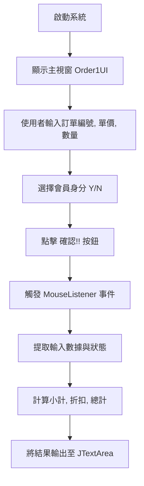
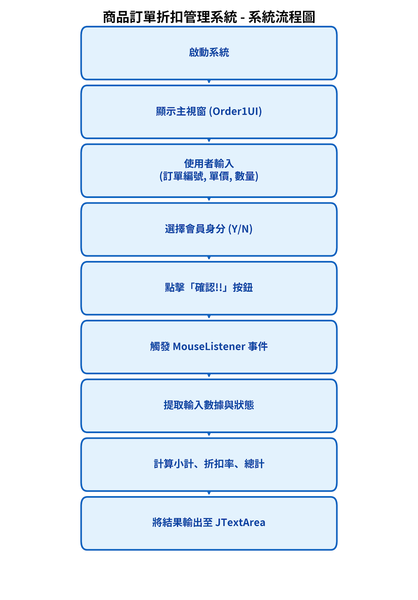

# 商品訂單折扣管理系統 (Order Discount Management System)

## 1. 專案名稱與簡介 (Project Title & Description)
**專案名稱**：商品訂單折扣管理系統
**簡介**：本專案提供一個基於 Java Swing 建立的圖形化使用者介面 (GUI)，用於管理商品訂單及計算折扣。系統允許使用者輸入訂單資訊（如訂單編號、單價、數量及會員身份），並自動計算小計、折扣率與總價。

## 2. 主要功能 (Features)
*   **訂單資訊輸入**：提供文字欄位輸入訂單編號、商品單價及數量。
*   **會員身份選擇**：透過單選按鈕 (Radio Button) 選擇是否為會員，影響折扣計算。
*   **自動計算**：依據輸入的數據與會員狀態，系統自動計算訂單總額與折扣。
*   **結果顯示**：提供文字區域 (Text Area) 即時顯示結帳明細。

## 3. 開發環境與技術 (Built With / Tech Stack)
*   **程式語言**：Java
*   **圖形介面**：Java Swing (JFrame, JPanel, JLabel, JTextField, JRadioButton, JTextArea, JButton)
*   **事件處理**：Java AWT Event (MouseListener)

## 4. 快速開始 (Getting Started)
1.  **環境準備**：請確認已安裝 JDK (Java Development Kit)。
2.  **編譯**：使用 `javac` 編譯專案中的 Java 原始碼。
3.  **執行**：執行 `Order1UI` 類別 (包含 `main` 方法) 啟動應用程式。

## 5. 專案目錄結構 (Project Structure)
```
/COM
 ├── Order1UI.class (主程式介面)
 ├── Order1UI$1.class (匿名內部類別 - 事件處理)
 └── Order1UI$2.class (匿名內部類別 - 按鈕監聽)
```

## 6. Method 說明
*   `public static void main(String[] args)`：應用程式進入點，透過 `EventQueue.invokeLater` 啟動 UI 執行緒。
*   `public Order1UI()`：建構子，負責初始化圖形介面，包含設定視窗大小、版面配置、各種控制元件(標籤、輸入框、按鈕) 的建立與定位。

## 7. OOP 重點
*   **封裝 (Encapsulation)**：使用類別 (`Order1UI`) 封裝 UI 邏輯與狀態變數。
*   **繼承 (Inheritance)**：`Order1UI` 繼承自 `javax.swing.JFrame`，擴充視窗功能。
*   **多型 (Polymorphism)**：內部匿名類別實作事件監聽介面 (如 `Runnable`, `MouseListener`)。
*   **內部類別 (Inner Classes)**：使用匿名內部類別處理按鈕點擊等事件，使程式碼結構更緊湊。

## 8. 系統流程


## 9. MVC架構流程圖 (概念性)
*此專案目前結構較偏向 UI 與邏輯混合，但可概念化為 MVC 架構。*

```mermaid
<hr>

```
